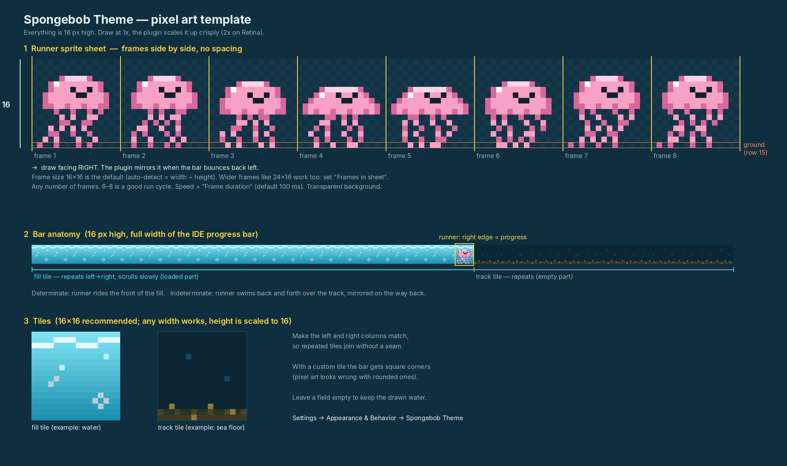

# Spongebob SquarePants Theme

<!-- Plugin description -->
A dark, underwater IntelliJ theme straight from the bottom of the ocean, plus a progress bar that's actually fun to watch.

- **Spongebob SquarePants** UI theme and matching editor color scheme: deep-ocean blues, SpongeBob-yellow caret and functions, Patrick-pink keywords, sandy strings and pineapple-orange annotations.
- **Underwater progress bar** with water, drifting light rays and bubbles. A runner swims along the front while things load (and bounces back and forth for indeterminate tasks).
- **Bring your own pixel art**: a sprite sheet or animated GIF as the runner, plus optional tiles for the bar, in *Settings → Appearance & Behavior → Spongebob Theme*. Default is a little jellyfish.
<!-- Plugin description end -->


## Install

**From a release (easiest)**

1. Download the latest `.zip` from [Releases](https://github.com/OumaimaZerouali/Spongebob_themed/releases/latest).
2. IntelliJ → *Settings → Plugins → ⚙️ → Install Plugin from Disk…* → choose the zip.
3. *Settings → Appearance & Behavior → Appearance → Theme* → **Spongebob**.

**From source**

```bash
./gradlew buildPlugin        # zip ends up in build/distributions/
./gradlew runIde             # try it in a sandbox IDE
```

Requires IntelliJ-based IDEs 2024.3 or newer (IDEA, WebStorm, PyCharm, …).

## Make it yours 🎨

The runner and the bar are fully customizable. You can swap the jellyfish/Spongebob for **any character you like**: your own pixel art, a sprite sheet you found, or an animated GIF.

### 1. Put your images in `my-sprites/`

Create a `my-sprites/` folder in the project (or anywhere on your machine) and drop your images in it:

```
spongebob_theme/
└── my-sprites/            ← git-ignored, never pushed
    ├── run-sheet.png      ← your runner (sprite sheet or GIF)
    ├── fill.png           ← optional: loaded part of the bar
    └── track.png          ← optional: empty part of the bar
```

`my-sprites/` is in `.gitignore`, so your images stay local, even when you commit and push.

### 2. Point the plugin at them

*Settings → Appearance & Behavior → Spongebob Theme*

| Setting | What it does |
|---|---|
| **Runner image** | Your PNG sprite sheet, single image or animated GIF. Empty = built-in jellyfish. |
| **Auto-slice** (on by default) | Removes the background (solid colour or transparent) and finds the frames on its own, even when they're unevenly spaced. Labels like "Running" are ignored. |
| **Row / character** | Sheets with several rows (e.g. one per character) show up here as *Row 1 – 8 frames*, *Row 2 – 8 frames*, … Pick one. |
| **Frame duration** | Animation speed. 70–100 ms is a good run cycle. |
| **Bar height** | *Auto* (16 px for pixel art, 32 px for big sprites) or a fixed 16/20/24/32 px. |
| **Fill tile / Track tile** | Optional tiles repeated over the loaded and empty part of the bar. Empty = drawn water. |
| **Grid frames** (advanced) | Only with auto-slice off, for strips whose frames touch each other. |

Press **Apply**: the live preview at the bottom shows the result right away. Edited the image? Press Apply again to reload it.
Untick *Use the underwater progress bar* to get IntelliJ's normal progress bar back while keeping the colours.

### 3. Drawing your own pixel art

Specs, blank canvases and working examples are in [`templates/`](templates/README.md):

- runner frames are **16 × 16 px, facing right**, side by side with no spacing (the plugin mirrors them when running back);
- tiles are **16 × 16 px** and should loop seamlessly left to right;
- draw at 1x; the plugin scales up with crisp pixels.



## Palette

| IntelliJ element | Colour | Hex |
|---|---|---|
| Editor background | Deep ocean | `#073B5C` |
| Main UI background | Midnight blue | `#041E32` |
| Current line | Subtle ocean blue | `#0D496A` |
| Selection | Ocean blue | `#009FE3` |
| Caret, functions, accents | SpongeBob yellow | `#FFD521` |
| Keywords | Patrick pink | `#F58AA8` |
| Strings | Sandy beige | `#F5DEB3` |
| Classes and types | Ocean cyan | `#45C7F5` |
| Annotations | Pineapple orange | `#F47B35` |
| Comments | Muted seafoam | `#85BDA6` |
| Errors | Coral red | `#FF6B6B` |
| Numbers | Seaweed green | `#9BE36B` |
| Fields, constants | Urchin purple | `#C59BFF` |

## Disclaimer

Unofficial, non-commercial fan project. Not affiliated with, sponsored or endorsed by Nickelodeon, Paramount or Viacom.
SpongeBob SquarePants is a trademark of Viacom International Inc. If you are a rights holder and want something changed, please open an issue.

## Credits

Build setup based on the [IntelliJ Platform Plugin Template](https://github.com/JetBrains/intellij-platform-plugin-template) (Apache 2.0).

## License

[MIT](LICENSE)
