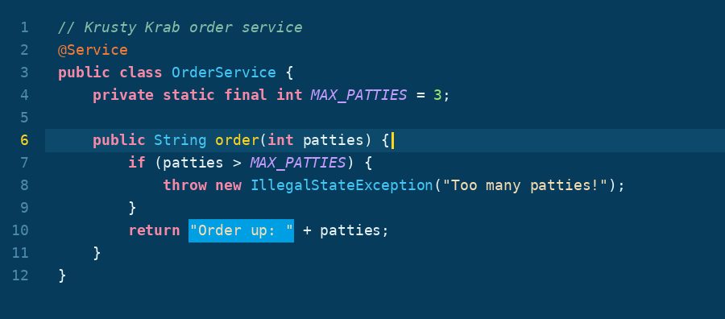
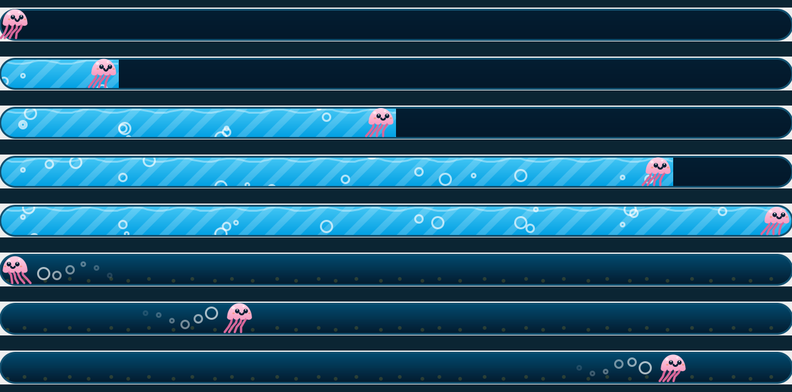

# Spongebob SquarePants Theme

<!-- Plugin description -->
A dark, underwater IntelliJ theme straight from the bottom of the ocean, plus a progress bar that's actually fun to watch.

- **Spongebob SquarePants** UI theme and matching editor color scheme: deep-sea blues, sponge-yellow accents, coral keywords, seaweed strings and jellyfish-pink numbers.
- **Underwater progress bar** with water, drifting light rays and bubbles. A runner swims along the front while things load (and bounces back and forth for indeterminate tasks).
- **Bring your own pixel art**: a sprite sheet or animated GIF as the runner, plus optional tiles for the bar, in *Settings → Appearance & Behavior → Spongebob Theme*. Default is a little jellyfish.
<!-- Plugin description end -->





## Install

**From a release (easiest)**

1. Download the latest `.zip` from [Releases](https://github.com/OumaimaZerouali/Spongebob_themed/releases/latest).
2. IntelliJ → *Settings → Plugins → ⚙️ → Install Plugin from Disk…* → choose the zip.
3. *Settings → Appearance & Behavior → Appearance → Theme* → **Spongebob SquarePants**.

**From source**

```bash
./gradlew buildPlugin        # zip ends up in build/distributions/
./gradlew runIde             # try it in a sandbox IDE
```

Requires IntelliJ-based IDEs 2024.3 or newer (IDEA, WebStorm, PyCharm, …).

## Custom runner & pixel art

*Settings → Appearance & Behavior → Spongebob SquarePants Theme*

- **Runner image**: a PNG sprite sheet (16 × 16 frames side by side, facing right), a single image or an animated GIF.
- **Auto-slice**: for a ripped sheet with a solid or transparent background and uneven spacing. The plugin removes the background, picks the row you choose and finds the frames itself (labels are ignored).
- **Bar height**: 16, 20, 24 or 32 px. Use a bigger bar for bigger sprites so they don't get shrunk.
- **Fill tile / Track tile**: optional 16 px high tiles for the loaded and empty part of the bar.
- Untick the checkbox to get the normal progress bar back, while keeping the colors.

Specs, blank canvases and working examples are in [`templates/`](templates/README.md).

The repository only ships the built-in jellyfish. Images you choose stay on your machine. Tip: keep them in a `my-sprites/` folder, which is git-ignored.

## Palette

| IntelliJ element | Colour | Hex |
|---|---|---|
| Editor background | Deep ocean | `#073B5C` |
| Main UI background | Midnight blue | `#041E32` |
| Current line | Subtle ocean blue | `#0D496A` |
| Selection | Ocean blue | `#009FE3` |
| Caret, functions, accents | SpongeBob yellow | `#FFD521` |
| Keywords | Patrick pink | `#F58AA8` |
| Strings | Sandy beige | `#F5DEB3` |
| Classes and types | Ocean cyan | `#45C7F5` |
| Annotations | Pineapple orange | `#F47B35` |
| Comments | Muted seafoam | `#85BDA6` |
| Errors | Coral red | `#FF6B6B` |
| Numbers | Seaweed green | `#9BE36B` |
| Fields, constants | Urchin purple | `#C59BFF` |

## Disclaimer

Unofficial, non-commercial fan project. Not affiliated with, sponsored or endorsed by Nickelodeon, Paramount or Viacom.
SpongeBob SquarePants is a trademark of Viacom International Inc. No official artwork, logos or characters are included in this repository.
If you are a rights holder and want something changed, please open an issue.

## Credits

Build setup based on the [IntelliJ Platform Plugin Template](https://github.com/JetBrains/intellij-platform-plugin-template) (Apache 2.0).

## License

[MIT](LICENSE)
